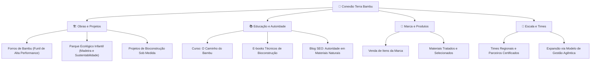

# 🌿 Conexão Terra Bambu — Ecossistema Digital de Alta Performance

Este projeto representa a evolução da **Conexão Terra Bambu** de uma executora de obras para uma **plataforma de autoridade e cultura ecológica**.

Utilizamos uma infraestrutura moderna de **Spec-Driven Development (SDD)** combinada com tecnologias de ponta para garantir escala, design premium e performance.

---

## 🏗️ Visão Estratégica do Ecossistema

O projeto foi estruturado para suportar o crescimento modular da marca, integrando obras, educação e produtos.

---

## 🤖 Governança para Agentes (Cérebro do Projeto)

Implementamos uma camada de inteligência estruturada na pasta [`.agents/`](.agents/) que governa o desenvolvimento. Isso garante que qualquer agente de IA ou desenvolvedor atue com o **Tom de Voz** e os **Padrões de Qualidade** da marca sem desvios.

- **PRD Estratégico**: Define a missão, pilares e roadmap de longo prazo.
- **Rules (Regras Globais)**: Tom de voz **Aspiracional/Premium**, proibição de foco na "dor" e padrões de UI.
- **Specs por Domínio**: Especificações técnicas isoladas para a LP de Forros, Blog e Site Institucional.
- **Skills e Workflows**: Manuais de execução para tarefas recorrentes (novos posts, novos produtos).

---

## 💻 Stack Tecnológica (Nível Premium)

A infraestrutura foi construída com as tecnologias mais rápidas e fluidas do mercado atual:

- **Frontend (LPs)**: React + Vite + Tailwind CSS (Performance extrema e carregamento imediato).
- **Animações**: Framer Motion (Transições fluidas que elevam a percepção de luxo).
- **Blog**: Arquitetura SSG (Static Site Generation) com Node.js para SEO máximo e custo zero de servidor.
- **IA de Atendimento**: Atendimento inteligente integrado que reduz o tempo de resposta de horas para minutos.

---

## 📊 Status de Implementação

### Recém Atualizado (Onda 2)
- ✅ **Nova Headline Aspiracional**: Foco no design que respira e natureza que acolhe.
- ✅ **Novo Produto**: Lançamento do card **Painel Trançado** com design exclusivo.
- ✅ **Estatísticas de Escala**: Destaque para +3.000m² transformados e 5 anos de garantia.
- ✅ **Integração IA**: Prazo de resposta atualizado para minutos.

### Roadmap (Onda 3)
- 🔜 **LP Parque Ecológico Infantil**: Foco em diversão sustentável.
- 🔜 **Funil de Infoprodutos**: Lançamento do primeiro e-book.
- 🔜 **Expansão de Projetos**: Portfólio de consultoria de bioconstrução.

---

## ⚡ Como Navegar no Projeto

- 📱 **LP de Conversão (React)**: [`/terrabambu-lp/`](terrabambu-lp/)
- 🏠 **Home Institucional**: [`index.html`](index.html)
- 📚 **Blog de Autoridade**: [`/blog/`](blog/)
- 📁 **Arquivo de Documentação**: [`/docs/_archive/`](docs/_archive/)

---

> © {new Date().getFullYear()} Conexão Terra Bambu · Todos os direitos reservados.  
> **CNPJ**: 54.340.235/0001-08
