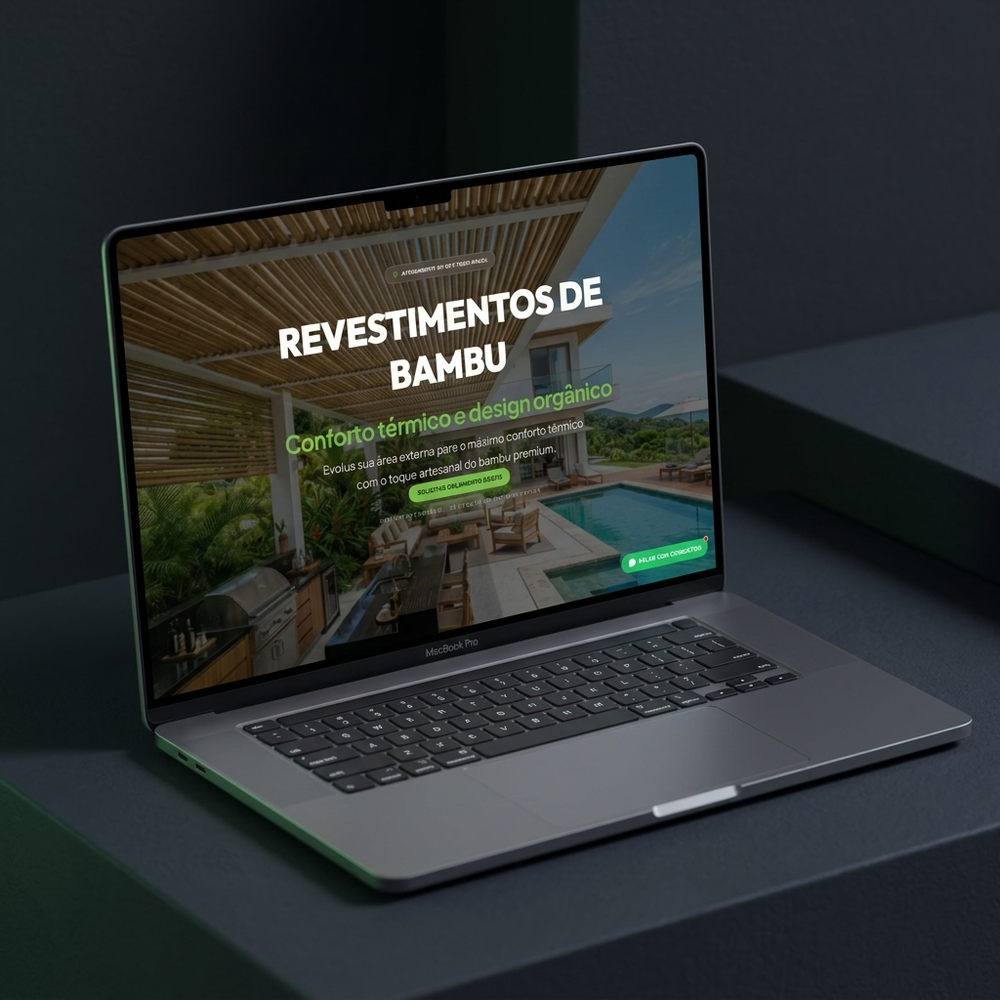
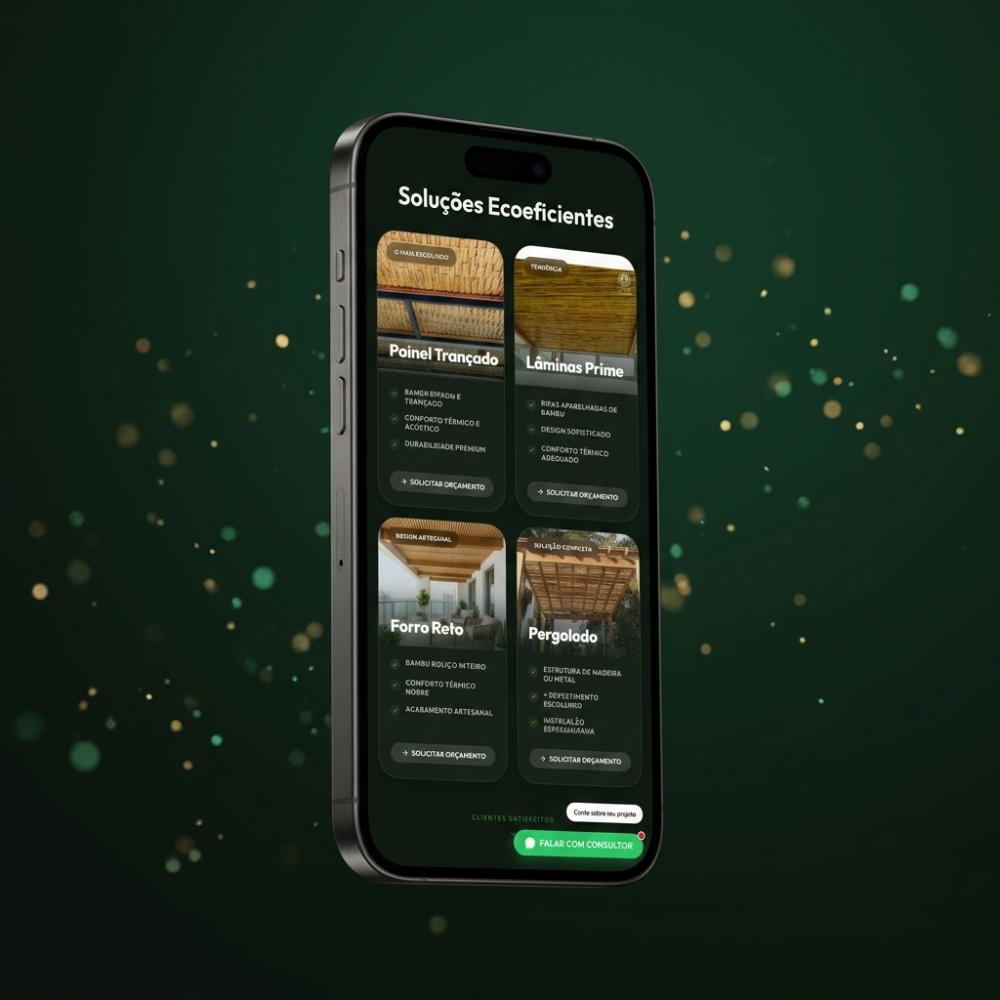

# 🌿 Terra Bambu: Agentic Architecture & Premium Design
**O Ecossistema de Bioconstrução Ouro, orquestrado por IA e Spec-Driven Development.**

---

  

## 📱 Mobile Showcase (Vertical 9:16 Presentation)
Projetada para ser impecável na palma da mão. Abaixo, uma apresentação no formato vertical demonstrando a fluidez da navegação mobile, o carrossel de fotos facilitado e o acesso imediato ao WhatsApp.

  <video src="docs/showcase/mobile-presentation-916.mp4" width="300" autoplay loop muted playsinline></video>

## ⚡ Live Preview (Experience the Motion)
Não é apenas estático. Abaixo você vê a fluidez das animações premium geradas via Framer Motion, capturadas diretamente da nossa infraestrutura de produção.

  <video src="docs/showcase/live-preview.mp4" width="700" autoplay loop muted playsinline></video>

---

## 🧬 Architecture Blueprint (Technical Flow)

Este projeto não foi "codado", ele foi **especificado**. Abaixo, a planta técnica de como a IA orquestra o ecossistema a partir de regras rígidas e componentes atômicos.

```mermaid
graph TD
    subgraph BRAIN ["THE BRAIN (Governance)"]
        R[".agents/rules.md"] --> |Tom de Voz & UI| AI[Agentic Intelligence]
        P[".agents/prd.md"] --> |Metas de Negócio| AI
        S[".agents/skills/"] --> |Design Tokens| AI
    end

    subgraph MACHINE ["THE MACHINE (LP v2)"]
        AI --> |Orquestra| H["HeroEmocional.jsx"]
        AI --> |Valida| PV["ProvaVisualEmocional.jsx"]
        AI --> |Gera| SO["SolucoesEmocional.jsx"]
        AI --> |Resolve| FAQ["FAQEmocional.jsx"]
    end

    subgraph OUTPUT ["THE OUTPUT"]
        H --> L1["Head: High Priority"]
        PV --> L2["Motion Counters"]
        SO --> L3["Interactive Cards"]
        FAQ --> L4["Accordion State"]
    end

    style AI fill:#0D1810,stroke:#7EC850,color:#7EC850
    style R fill:#162212,stroke:#A8D970
    style P fill:#162212,stroke:#A8D970
    style S fill:#162212,stroke:#A8D970
```

---

## 🏆 Visual Framework & Component Gallery

Uma jornada imersiva por cada "Pilar de Conversão" do projeto. Passe o olho (ou clique) para entender a estratégia por trás do design.

### 1️⃣ O Impacto (Hero Section)

  

> [!TIP]
> **Estratégia**: Substituímos a "dor" pelo "desejo". O background em *Parallax* cria profundidade, enquanto a tipografia *Outfit* em peso 900 estabelece autoridade imediata. 
> - **Arquivo**: `src/components/HeroEmocional.jsx`

### 2️⃣ A Autoridade (Prova Visual)

  

> [!IMPORTANT]
> **Estratégia**: Ancoras numéricas. Através de `framer-motion`, os números sobem dinamicamente ao entrar em scroll, forçando a leitura de métricas cruciais (+3.000m² transformados).
> - **Arquivo**: `src/components/ProvaVisualEmocional.jsx`

### 3️⃣ A Oferta (Soluções Premium)

  

> [!NOTE]
> **Estratégia**: Navegação Mobile-First. Cada card de produto é interativo e leva a um **WhatsApp Parametrizado**, garantindo que o lead chegue ao comercial já sabendo qual produto deseja.
> - **Arquivo**: `src/components/SolucoesEmocional.jsx`

---

## 🛠️ Ecossistema de Governança
A inteligência do projeto está centralizada na pasta `/.agents/`. É aqui que mora a "Constituição" da marca:

*   **Premium Design Skill**: Proíbe a IA de usar cores fora da paleta (tokens) e força o uso de animações suaves.
*   **Business Specs**: Regras de negócio que definem como scripts de tracking (FB Pixel e GA) devem ser injetados de forma limpa.
*   **Automated Assets**: Uso de Node + Puppeteer + Sharp para conversão massiva de imagens em WebP, garantindo performance 100/100.

---

## 🚀 Roadmap: A Evolução da Marca
Este é um projeto vivo que escala para além da LP:
- [x] **LP v2 (Ouro)**: Unificação e Otimização Final.
- [ ] **Blog de Autoridade**: Ingestão de SEO local para capturar leads orgânicos.
- [ ] **E-commerce de Produtos**: Venda direta de materiais tratados e acessórios.
- [ ] **Academy**: Curso "O Caminho do Bambu" para profissionais.

---

> © 2026 Conexão Terra Bambu · Todos os direitos reservados.  
> **CNPJ**: 54.340.235/0001-08
