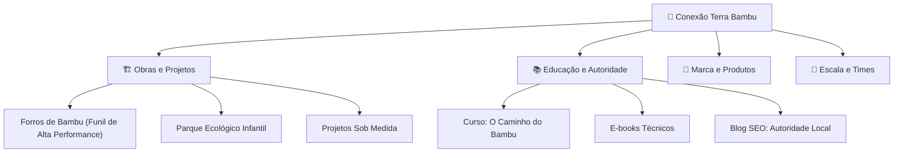
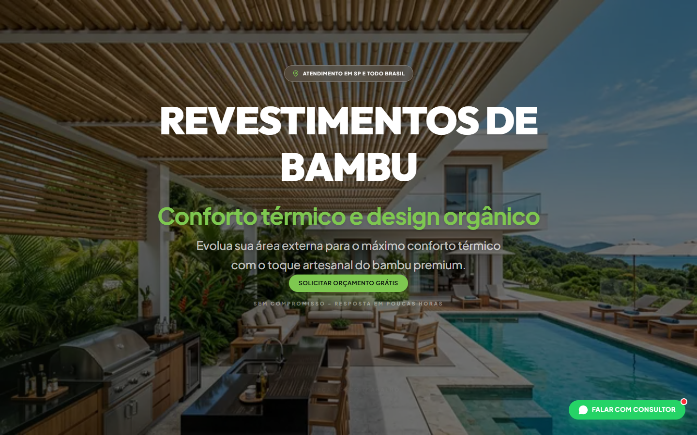
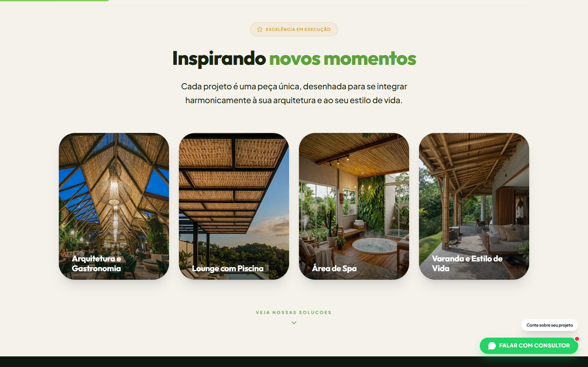
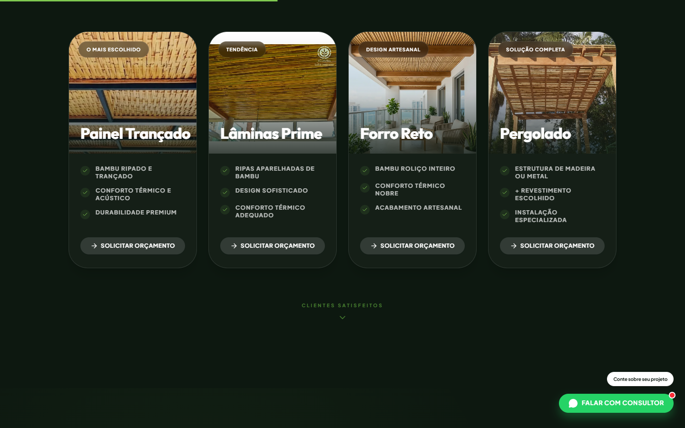
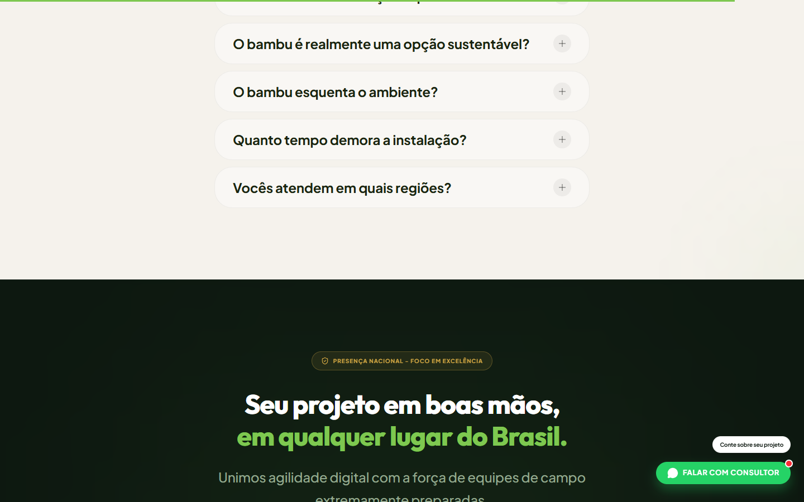

# 🌿 Case Study: Spec-Driven Development (SDD) & Agentic AI
**Terra Bambu Ecosystem — Premium Landing Page v2**

Este repositório é um **Estudo de Caso "Padrão Ouro"** demonstrando a criação de um ecossistema digital amplo usando Spec-Driven Development (SDD) integrado a robôs guiados por inteligência artificial (Agentic AI). 

O projeto representa a evolução da **Conexão Terra Bambu** de uma executora de obras para uma **plataforma de autoridade e cultura ecológica**, abrangendo Landing Pages de Alta Performance, Plataforma Institucional e um Blog voltado a SEO de cauda longa.

---

*(O gráfico acima reflete todas as frentes que este repositório visa atender de forma independente, modular, mas unificada)*

---

## 🎨 O Resultado (Vitrine)

A arquitetura orientada resultou em um design premium ("apple-like"), respeitando diretrizes rígidas de branding e performance.

<table>
  <tr>
    <td align="center"><b>Hero Header</b></td>
    <td align="center"><b>Design Emocional (Apresentação)</b></td>
  </tr>
  <tr>
    <td></td>
    <td></td>
  </tr>
  <tr>
    <td align="center"><b>Soluções & Interatividade</b></td>
    <td align="center"><b>FAQ Fluido</b></td>
  </tr>
  <tr>
    <td></td>
    <td></td>
  </tr>
</table>

**URL de Produção Final:** [conexaoterrabambu.com.br/lp/forros-bambu](https://conexaoterrabambu.com.br/lp/forros-bambu/)

---

## 🧠 A Filosofia Agentic (The AI Brain)

O grande diferencial deste projeto é como a pasta interna estrita governou o trabalho da IA. Diferente de fluxos onde a IA gera "qualquer código", este repositório possui uma "Constituição", garantindo que **a inteligência artificial mantenha controle absoluto sobre a linguagem da marca, UI tokens e regras restritas**.

As especificações vitais para LPs geradas com IA estão estruturadas no diretório escondido [`/.agents/`](.agents/):

- 📜 **[`.agents/prd.md`](.agents/prd.md)**: Product Requirements Document. Ensina o Agente de IA qual é o funil, o ICP e as metas de conversão do ecossistema.
- ⚖️ **[`.agents/rules.md`](.agents/rules.md)**: Restrições Inquebráveis. Ordem expressa para evitar textos que foquem apenas "na dor" ou que percam a *vibe* premium/orgânica.
- 🧰 **[`.agents/skills/`](.agents/skills/)**: Habilidades Compartimentadas. A pasta `premium-design` obriga a IA a usar exatos tokens (`var(--accent)`), proibindo flex-align desalinhado e forçando o paradigma Mobile-first.
- 📄 **[`.agents/specs/`](.agents/specs/)**: Especificações isoladas que servem de bússola para páginas únicas (ex: `.opts` de deploy).

Essa estrutura forçou os agentes de IA a entregar **Zero Halucinações** em relação a cor e código. A IA trabalhou obedecendo ordens específicas e formatando corretamente todas as 48 variáveis CSS de design.

---

## 💻 Tech Stack & Performance (Nível Premium)

A base tecnológica foi montada pela IA focando em **100/100 Core Web Vitals**:

- **Core & Build LPs**: Vite + React
- **Estilização Global**: Tailwind CSS puramente guiado por CSS Variables (+40 `src/styles/tokens.css`).
- **Blog & Institucional**: Arquivos indexados e arquiteturas prontas para SSG (Static Site Generation), desenhados para atrair SEO Local e capturar leads no topo do funil. 
- **Animações (UX)**: Framer Motion isolado em `src/shared/animations.premium.js` para carregamento leve e padronizado nas páginas React.
- **Ecossistema Otimizado**: Scripts robustos via Node garantindo que artigos do Blog e conversões da Landing Page convivam sem quebrar as hierarquias. Todas as imagens processadas massivamente para WebP em alta velocidade.

---

## 🚀 Road to Level 5 (O Próximo Passo na Governança Agentic)

Embora o ecossistema atual possua uma base robusta sem utilizar CI/CD complexo (deploy nativo pelo GitHub Pages isolado dos Actions para evitar falhas passadas), um "Full Autonomy System" ainda precisaria de alguns toques no escopo aberto:

1. **Testes de Qualidade Finais Automatizados por Agentes (Lighthouse AI QA)**: Um step em que robôs rodam análise de DOM no deploy provisório antes do merge.
2. **Master Cursor Rules**: Uma regra base de `.cursorrules` no root da aplicação ativando e conectando todos os arquivos da pasta `.agents` globalmente, dispensando a necessidade de indicar ao bot de onde ler os dados no início do prompt.
3. **Design Tokens via Style Dictionary**: Em vez da alteração puramente em `.css`, um JSON Master ditando os tokens do projeto (podendo ser injetado facilmente por IA).

---

> © 2026 Conexão Terra Bambu · Todos os direitos reservados.  
> **CNPJ**: 54.340.235/0001-08
